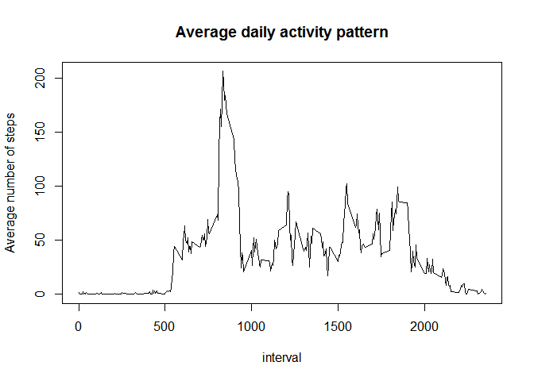
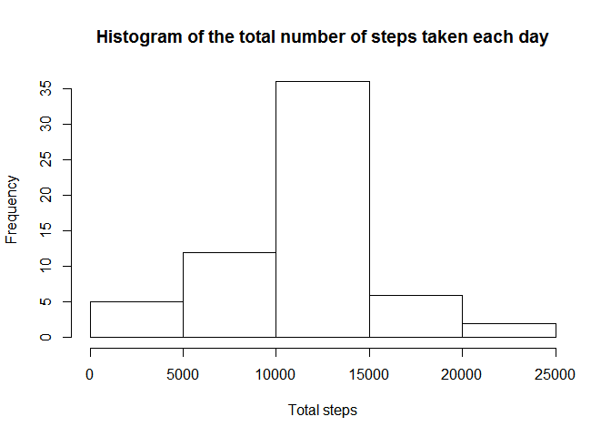
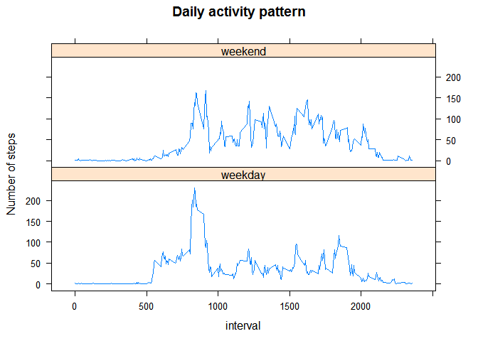

# Reproducible Research: Peer Assessment 1


## Loading and preprocessing the data  
Load the data from ziped file and coerce variables to propper classes:


```r
act <- read.csv(unz("activity.zip", "activity.csv"), stringsAsFactors=FALSE)

act$date <- as.Date.character(act$date, "%Y-%m-%d")
# act$interval <- as.character(act$interval)

str(act)
```

```
## 'data.frame':	17568 obs. of  3 variables:
##  $ steps   : int  NA NA NA NA NA NA NA NA NA NA ...
##  $ date    : Date, format: "2012-10-01" "2012-10-01" ...
##  $ interval: int  0 5 10 15 20 25 30 35 40 45 ...
```


## What is mean total number of steps taken per day?

Grouping by day and summarise `steps` into daily sums using {dplyr} package, then find mean value of daily total steps:


```r
library(dplyr)
```

```
## 
## Attaching package: 'dplyr'
## 
## The following object is masked from 'package:stats':
## 
##     filter
## 
## The following objects are masked from 'package:base':
## 
##     intersect, setdiff, setequal, union
```

```r
day_tot <-act %>%
        group_by(date) %>%
        summarise(steps=sum(steps))
day_tot_avg <- mean(day_tot$steps, na.rm = TRUE)

day_tot_avg
```

```
## [1] 10766.19
```

**Answer:** The mean total number of steps taken per day can be rounded to **10 766 steps**.


## What is the average daily activity pattern?

Make a new object containing averaged `steps` for each `interval`:


```r
intvl_avg <- act %>% 
        group_by(interval) %>% 
        summarise(steps=mean(steps, na.rm = TRUE))
```

Plot the resulted daily pattern:


```r
with(intvl_avg, plot(steps~interval, type = "l",
                     main = "Average daily activity pattern",
                     ylab = "Average number of steps"
                     ))
```

 

And find the most active interval:


```r
intvl_avg[which.max(intvl_avg$steps),]
```

```
## Source: local data frame [1 x 2]
## 
##   interval    steps
## 1      835 206.1698
```

**Answer:** across all the days in the dataset, on average, the maximum number of steps contains an interval **between 8:35 and 8:40 AM**.


## Imputing missing values

Calculate the total number and ratio of missing values in the dataset:

```r
## total NA rows:
sum(is.na(act))
```

```
## [1] 2304
```

```r
## ratio, %
round(mean(is.na(act))*100,1)
```

```
## [1] 4.4
```

Use mean values for the 5 min interval across all days to fill the missing values in `act` and save gap-filled data as `act.filled`:


```r
act.filled <- act

for (i in 1:nrow(act.filled)){
        if(is.na(act.filled$steps[i])) {
                ## mark an interval of the NA:
                interval_of_NA <- act.filled$interval[i]
                ## take average step value for the interval from "intvl_avg"
                avg_steps <- intvl_avg$steps[which(intvl_avg$interval==interval_of_NA)]
                ## fill the NA
                act.filled$steps[i] <- avg_steps
        }
}

# amount of NA rows in "act.filled":
sum(is.na(act.filled))
```

```
## [1] 0
```

Make a histogram of the total number of steps taken each day and Calculate and report the mean and median total number of steps taken per day:


```r
day_tot.filled <-act.filled %>%
        group_by(date) %>%
        summarise(steps=sum(steps))

hist(day_tot.filled$steps,
     main="Histogram of the total number of steps taken each day",
     xlab = "Total steps")
```

 

For compare mean and median of total day steps between original and filled datasets, print out summaries:

```r
## Original data:
summary(day_tot$steps)
```

```
##    Min. 1st Qu.  Median    Mean 3rd Qu.    Max.    NA's 
##      41    8841   10760   10770   13290   21190       8
```

```r
## gap-filled data:
summary(day_tot.filled$steps)
```

```
##    Min. 1st Qu.  Median    Mean 3rd Qu.    Max. 
##      41    9819   10770   10770   12810   21190
```
The **mean values of daily total steps are the same**, which is not surprising as we filled the gaps with mean values.  
**The median of gap-filled dataset slightly greater and equal to mean value**

But the difference is in total amount of steps measured through all measurement period:

```r
## original data:
sum(day_tot$steps, na.rm=TRUE)
```

```
## [1] 570608
```

```r
## gap-filled data:
sum(day_tot.filled$steps)
```

```
## [1] 656737.5
```


## Are there differences in activity patterns between weekdays and weekends?

Create a new factor variable in the dataset with two levels -- "weekday" and "weekend" indicating whether a given date is a weekday or weekend day:


```r
act.filled.wd <- act.filled %>% 
        mutate(daytype=weekdays(date)%in%c("Saturday", "Sunday")) %>%
        mutate(daytype = as.factor(daytype))

levels(act.filled.wd$daytype)<- c("weekday","weekend")
```

Make a panel time series plot  of the 5-minute interval (x-axis) and the average number of steps taken, averaged across all weekday days or weekend days (y-axis):

```r
# make a dataset for plotting:
intvl_avg.wd <- act.filled.wd %>%
        group_by(interval,daytype) %>%
        summarise(steps=mean(steps))

# make a plot
library(lattice)

xyplot(data = intvl_avg.wd, steps~interval|daytype, 
       type="l", layout=c(1,2),
       main="Daily activity pattern",
       ylab="Number of steps")
```

 

**Answer:** here we see that on weekends there is more activity during daytime (9:00 - 18:00).
